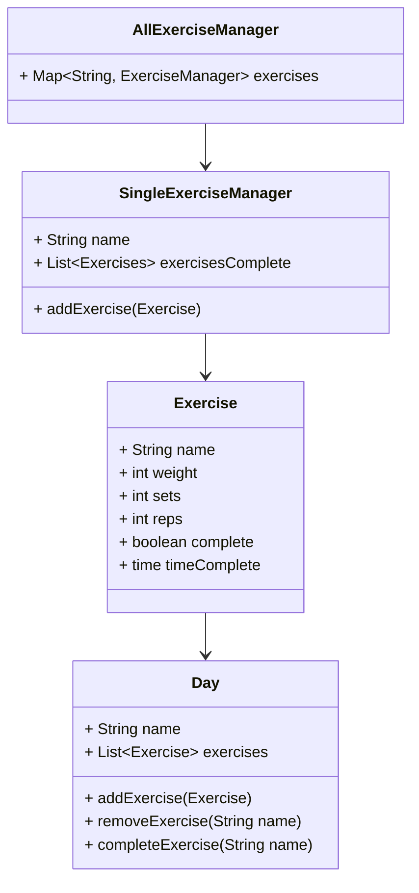

```mermaid
classDiagram
    Exercise --> Day
    SingleExerciseManager --> Exercise
    AllExerciseManager --> SingleExerciseManager

    class Exercise {
        + String name
        + int weight
        + int sets
        + int reps
        + boolean complete
        + time timeComplete
    }

    class Day {
        + String name
        + List~Exercise~ exercises
        + addExercise(Exercise)
        + removeExercise(String name)
        + completeExercise(String name)
    }

    class SingleExerciseManager {
        + String name
        + List~Exercises~ exercisesComplete
        + addExercise(Exercise)
    }

    class AllExerciseManager {
        + Map~String, ExerciseManager~ exercises
    }
```
